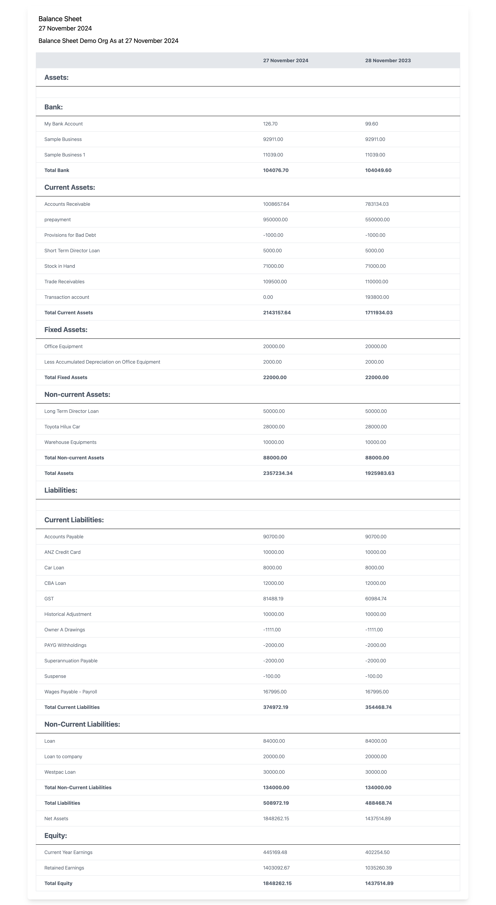

# Balance Sheet Preview

A small project to demonstrate how to use the Xero API to fetch the Balance Sheet Report.


## Tech Stack

**Client:** React, Redux, TailwindCSS, Vite, TypeScript

**Server:** Node, Express, Axios, Cors, Morgan


## Environment Variables

To run this project, you will need to add the environment variables from `env-example` to `.env`  

```sh
cp env-example .env
```
  
## Run Locally

Clone the project

```bash
  git clone https://github.com/sridhar02/demyst-test.git
```

Go to the project directory

```bash
  cd demyst-test
```

Install dependencies

Install of frontend with npm

```bash
  cd frontend
  npm install 
  
```

Install of backend with npm

```bash
  cd backend
  npm install 
``` 
## Running Tests

To run tests for backend, run the following command

```bash
  cd backend
  npm run test
```


## Screenshots




## License

[MIT](https://choosealicense.com/licenses/mit/)

